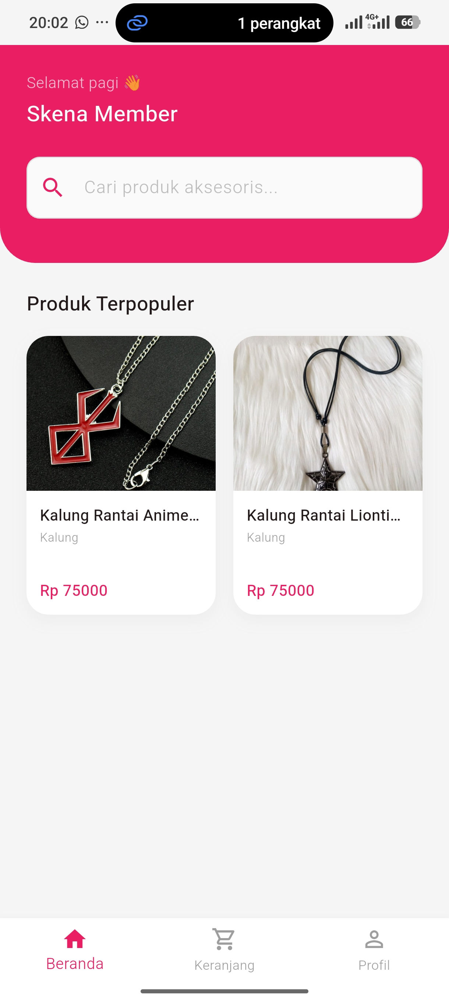
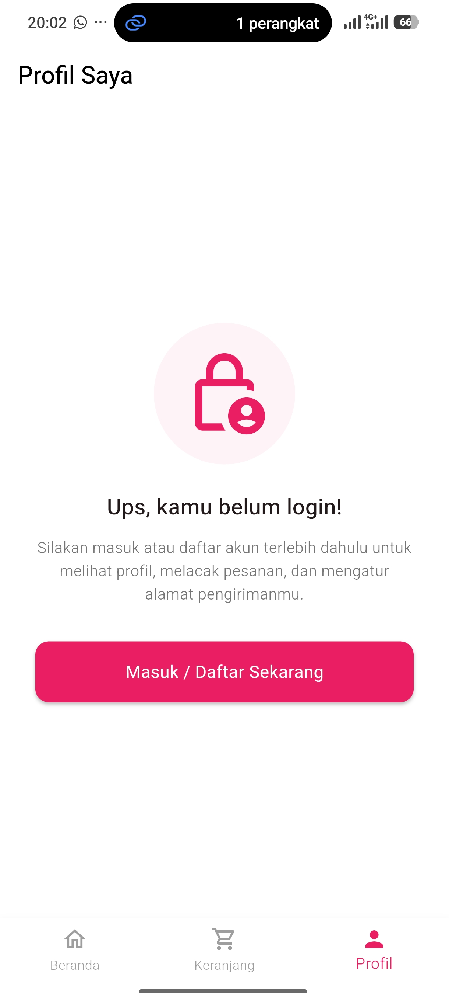
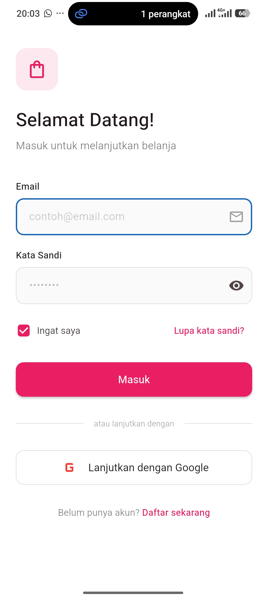
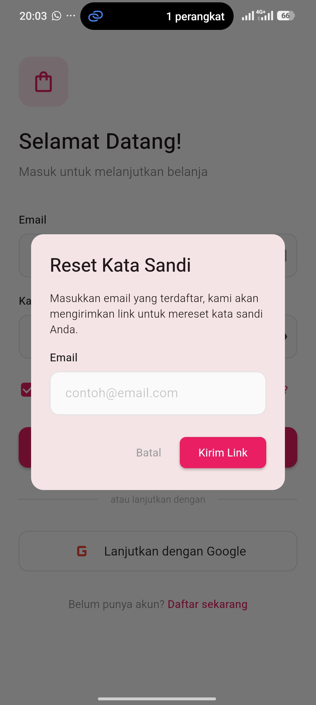
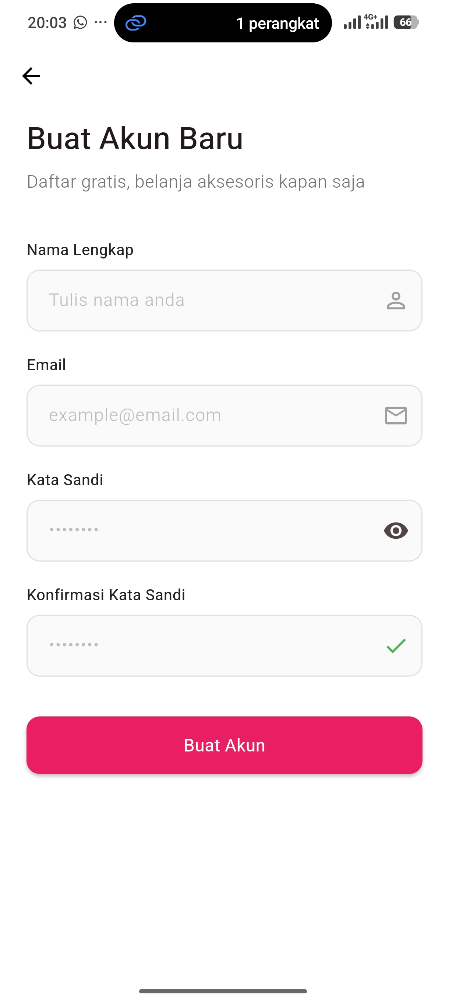

# Skenaid Frontend App

<div align="center">
  
</div>

<div align="center">
Institut Teknologi dan Bisnis Bina Sarana Global <br>
FAKULTAS TEKNOLOGI INFORMASI & KOMUNIKASI <br>
https://global.ac.id/
</div>

## Project UAS

- Nim : 1123150045
- Nama : Dzidan Rafi Habibie
- Mata Kuliah : Pemrograman Mobile Lanjutan
- Kelas : TI-SE 23 M

## Deskripsi Project

Project ini adalah aplikasi frontend mobile untuk platform e-commerce Skenaid, dibangun menggunakan Flutter dengan bahasa Dart. Aplikasi ini menerapkan feature-based Clean Architecture (data, domain, presentation per fitur) dengan Provider untuk state management, serta terintegrasi dengan Firebase dan backend Skenaid (Go) untuk proses autentikasi, katalog produk, keranjang, dan pemesanan. Aplikasi ini juga mendukung deep link dengan aplikasi Skewallet untuk proses pembayaran.

## Link proyek lain yang terintegrasi
- **[Backend skenaid (ecommerce)](https://github.com/KishiEdward/back-skenaid)**
- **[Frontend skenaid (ecommerce)](https://github.com/KishiEdward/front-skenaid)**
- **[Backend skewallet (ewallet)](https://github.com/KishiEdward/back-skewallet)**
- **[Frontend skenaid (ewallet)](https://github.com/KishiEdward/front-skewallet)**

## Demo Video

Lihat demo aplikasi dan alur fitur yang tersedia dalam video berikut.

**[Watch Full Demo on YouTube](https://youtu.be/nH3QIb8kl5Y?si=aauAhLBWTEnz3KKc)**

### Screenshot Aplikasi

**Belum login dan fitur login, regis**

|  |  |
|  |  |
|  |


**Fitur Dashboard & Produk**

| Tangkapan Layar 1 | Tangkapan Layar 2 | Tangkapan Layar 3 |
| :---: | :---: | :---: |
|  |  |  |
|  |  |  |
|  |  |  |

**Tabel 3: Fitur Cart, Order & Pembayaran**

| Tangkapan Layar 1 | Tangkapan Layar 2 | Tangkapan Layar 3 |
| :---: | :---: | :---: |
|  |  |  |
|  |  |  |
|  |  |  |

## Fitur Utama

- Autentikasi pengguna (login, register) dengan Firebase Authentication
- Dashboard/home dengan daftar dan pencarian produk
- Keranjang belanja (cart)
- Pemesanan (order) dan riwayat transaksi
- Manajemen profil pengguna
- Deep link integration dengan aplikasi Skewallet untuk proses pembayaran
- State management menggunakan Provider
- Custom routing untuk navigasi antar halaman

## Teknologi yang Digunakan

- **[Flutter](https://flutter.dev/)** - Framework UI mobile cross-platform
- **[Dart](https://dart.dev/)** - Bahasa pemrograman
- **[provider](https://pub.dev/packages/provider)** - State management
- **[Firebase](https://firebase.google.com/)** - Authentication

## Persyaratan Sistem

Pastikan perangkat Anda sudah memiliki:

- Flutter SDK (versi terbaru yang stabil)
- Android Studio / Xcode (untuk emulator/simulator)
- Firebase project yang sudah dikonfigurasi
- Backend Skenaid API sudah berjalan
- Git

## Cara Menjalankan Project

### 1. Clone Repository

```bash
git clone https://github.com/KishiEdward/front-skenaid.git
cd skenaid_front
```

### 2. Install Dependency

```bash
flutter pub get
```

### 3. Siapkan Firebase

- Buat project Firebase
- Aktifkan Authentication
- Download file `google-services.json` (Android) / `GoogleService-Info.plist` (iOS)
- Pastikan `firebase_options.dart` sudah sesuai dengan konfigurasi project Firebase Anda

### 4. Siapkan Konfigurasi Backend

Sesuaikan base URL API backend Skenaid pada file konfigurasi service di `lib/core/services`, contohnya:

```dart
const String baseUrl = "http://localhost:8080/v1";
```

### 5. Jalankan Aplikasi

```bash
flutter run
```

## Struktur Project

```bash
lib/
├── core/                          # Komponen inti yang digunakan lintas fitur
│   ├── constants/
│   ├── routes/
│   ├── services/
│   ├── theme/
│   └── widgets/
├── features/                      # Modul fitur (feature-based architecture)
│   ├── auth/
│   │   ├── data/
│   │   │   ├── models/
│   │   │   └── repositories/
│   │   ├── domain/
│   │   │   └── repositories/
│   │   └── presentation/
│   │       ├── pages/
│   │       ├── providers/
│   │       └── widgets/
│   ├── cart/
│   │   ├── data/
│   │   │   ├── models/
│   │   │   └── repositories/
│   │   ├── domain/
│   │   │   └── repositories/
│   │   └── presentation/
│   │       ├── pages/
│   │       └── providers/
│   ├── dashboard/
│   │   ├── data/
│   │   │   └── models/
│   │   └── presentation/
│   │       ├── pages/
│   │       └── providers/
│   ├── order/
│   │   ├── data/
│   │   │   ├── models/
│   │   │   └── repositories/
│   │   ├── domain/
│   │   │   └── repositories/
│   │   └── presentation/
│   │       ├── pages/
│   │       └── providers/
│   └── profile/
│       ├── data/
│       │   └── models/
│       └── presentation/
│           ├── pages/
│           └── providers/
├── firebase_options.dart          # Konfigurasi Firebase
└── main.dart                      # Entry point aplikasi
```

## Arsitektur Aplikasi

Aplikasi ini menerapkan **feature-based Clean Architecture**, di mana setiap fitur (auth, cart, dashboard, order, profile) memiliki layer-nya sendiri:

- **Data Layer** - Mengelola model dan implementasi repository untuk fitur terkait
- **Domain Layer** - Berisi kontrak repository yang merepresentasikan business logic fitur
- **Presentation Layer** - Berisi UI (pages), state management (providers), dan widget khusus fitur

## Integrasi Deep Link

Aplikasi ini mendukung alur pembayaran lintas aplikasi bersama Skewallet:

- Aplikasi Skenaid memanggil skema `skewallet://pay` untuk membuka aplikasi Skewallet dan memproses pembayaran.
- Setelah transaksi selesai, Skewallet mengarahkan callback kembali ke Skenaid melalui skema `skenaid://payment-callback`.

## Lisensi

Project ini dilisensikan di bawah MIT License.

## Ucapan Terima Kasih

- [Flutter Community](https://flutter.dev/community)
- [Firebase](https://firebase.google.com/)
- [Provider](https://pub.dev/packages/provider)

---

<div align="center">
  <p>© 2026 Skenaid Frontend App. All rights reserved.</p>
</div>
